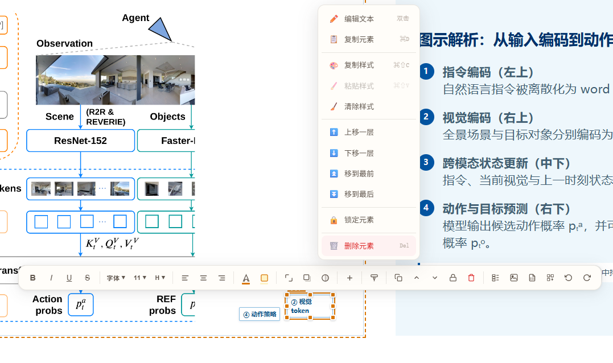
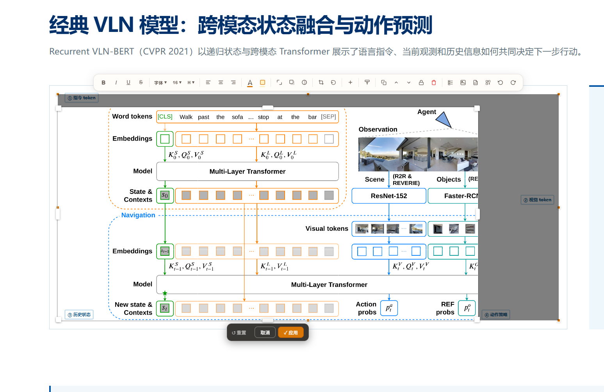
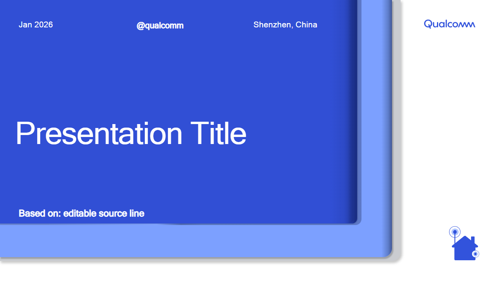

# HTML Visual Editor

> Edit local HTML files visually like a PPT — drag, resize, tables, charts, image paste, image crop, auto-save

A Chrome extension that lets you visually edit HTML pages directly in the browser — no coding required.


[中文文档](./README_CN.md)

## ✨ Features

- 🖱️ **Drag & Move** — Select and drag elements to reposition them
- 📐 **Resize** — Drag handles to resize any element
- ✏️ **Text Editing** — Double-click text to edit content inline
- 🎨 **Style Toolbar** — Change font size, color, bold, alignment and more
- 📊 **Table Editing** — Add/remove rows & columns, merge cells
- 🖼️ **Image Handling** — Paste and replace images
- ✂️ **Image Crop** — PPT-style image cropping with 8-handle drag interface, real-time preview, and non-destructive `clip-path` output
- 💾 **Auto-Save** — After one-time `Ctrl+S` authorization, edits are automatically saved back to the source file 1.5 s after you stop typing
- 🎤 **Presenter Mode** — Dual-screen presenter view (press `P` in fullscreen): current slide, next slide preview, speaker notes, and a stopwatch — synced via BroadcastChannel
- 📏 **Alignment Guides** — Smart snap lines appear while dragging
- ↩️ **Undo / Redo** — Full operation history
- 📑 **Page Sorting** — PPT-style page reordering
- 🎨 **Canvas Mode** — Figma-like freeform drawing canvas with text, shapes, lines, arrows
- 🖨️ **PDF Pagination** — Preview page breaks and export HTML to PDF with smart pagination
- 📊 **Chart Typography** — Pre-built chart components (stat cards, KPI grids, legends, etc.) and fine typography controls

## 📦 Installation

### Install from Source (Developer Mode)

1. Clone this repository:
   ```bash
   git clone https://github.com/qti-timzhang/html-visual-editor.git
   ```

2. Open Chrome and navigate to `chrome://extensions/`

3. Enable **"Developer mode"** in the top-right corner

4. Click **"Load unpacked"** and select the project folder

5. Done! Click the extension icon on any local HTML page (`file:///` protocol) to start editing

## 🚀 Usage

1. Open a local HTML file in Chrome
2. Click the extension icon to enable edit mode
3. **Click** to select an element → a floating toolbar appears
4. **Drag** to move elements around
5. **Double-click** text to enter editing mode
6. When finished, click **Save** or press `Ctrl+S` to save

## 📸 Screenshots

### Floating Toolbar & Right-click Context Menu
Select any element to reveal the floating toolbar with formatting, style, and layout controls. Right-click for quick actions: copy/paste styles, move layers, lock, or delete elements.



### ✂️ Image Crop

1. Click to select any `` element — the toolbar shows a **✂️ crop button**
2. Click the crop button to enter crop mode
3. Drag any of the 8 handles (edges + corners) to adjust the crop region — real-time preview
4. Press **Enter** or click **✓ Apply** to confirm; press **Esc** or click **Cancel** to revert
5. Click **↺ Reset** (toolbar) to remove the crop at any time
6. Crop is stored as `clip-path: inset(...)` — original image data is never modified


*PPT-style crop mode — drag the 8 white handles to adjust the visible region. The dark overlay shows the cropped-out area. Click ✓ Apply to confirm.*

### 💾 Auto-Save

1. Make any edit, then press `Ctrl+S` once — Chrome asks for write permission to the file
2. Grant permission → from that point on, edits are **automatically saved** to the source file 1.5 seconds after you stop
3. The status bar (bottom-right) shows **"保存中…"** while saving and **"已保存"** when done
4. Permission resets when you close the tab — press `Ctrl+S` once per session to reauthorize

### 📥 Qualcomm PPT Template

A ready-to-use Qualcomm-branded HTML presentation template is bundled with the extension. Click **"下载 Qualcomm PPT 模板"** in the extension popup to download it, then open the file in Chrome and start editing immediately.


*Qualcomm HTML PPT template — cover slide. Includes 9 slide layouts: cover, agenda, section divider, content cards, comparison, process flow, table, diagram, and closing.*

## 🏗️ Project Structure

```
├── manifest.json          # Extension config (Manifest V3)
├── background/            # Service Worker
├── content/               # Content Scripts (core editing logic)
│   ├── editor-core.js     # Editor core controller (incl. auto-save)
│   ├── selector.js        # Element selector
│   ├── toolbar.js         # Floating toolbar
│   ├── drag-move.js       # Drag & move
│   ├── resize.js          # Resize handling (clip-path aware)
│   ├── text-edit.js       # Text editing
│   ├── table-edit.js      # Table editing
│   ├── image-handler.js   # Image handling
│   ├── image-crop.js      # Image crop (PPT-style, non-destructive)
│   ├── align-guide.js     # Alignment guides
│   ├── insert-panel.js    # Insert panel
│   ├── context-menu.js    # Context menu
│   ├── page-sorter.js     # Page sorting
│   ├── canvas-mode.js     # Canvas drawing mode
│   ├── pdf-paginator.js   # PDF pagination & export
│   ├── chart-typography.js# Chart components & typography
│   └── history.js         # Undo / Redo
├── popup/                 # Extension popup panel
├── sidepanel/             # Side panel
├── styles/                # CSS injected into pages
├── utils/                 # Utility functions
└── icons/                 # Extension icons
```

## 🗺️ Roadmap

- [x] 🎨 **Canvas Mode** — Figma-like freeform drawing canvas with text, shapes, lines, arrows, color picker, and SVG/PNG export
- [x] 📊 **Chart Typography** — Pre-built chart components (stat cards, KPI grids, legends, etc.) and fine-grained typography controls
- [x] 🖨️ **HTML-to-PDF Pagination** — Preview page breaks, smart pagination that avoids mid-element breaks, and PDF export
- [x] ✂️ **Image Crop** — PPT-style non-destructive image cropping with 8-handle drag interface and real-time preview
- [x] 💾 **Auto-Save** — Automatically overwrite the source file after one-time browser permission grant
- [x] 🎤 **Presenter Mode** — Dual-screen PPT-style presenter view with notes, next-slide preview, and timer
- [ ] 🔌 **Plugin System** — Extensible third-party plugin architecture
- [ ] 🤝 **Collaborative Editing** — Real-time multi-user editing support

## 🛠️ Tech Stack

- **Chrome Extension Manifest V3**
- **Vanilla JavaScript** (zero framework dependencies)
- **Content Scripts** inject editing capabilities
- **CSS** inline injection, no interference with original page structure

## 📋 Compatibility

- Chrome 88+ (Manifest V3 support)
- Supports `file:///` local files and `http(s)://` web pages

## 📄 License

MIT License

## 👤 Author

**Tim Zhang**
- Email: timzhang@qti.qualcomm.com
- GitHub: [@qti-timzhang](https://github.com/qti-timzhang)
